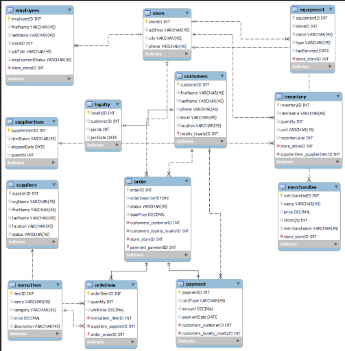
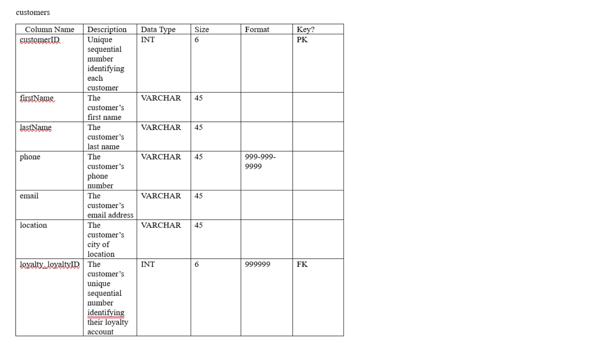

# Group 7 MIST 4610 Group Project 1

## Team Members
1) Mino Guzman
2) Sydney Pratt https://github.com/scp31975/Jiterry-Joe-s-
3) Ally McVay https://github.com/allymcvay/JitteryJoes
4) Casey Whichard https://github.com/caseywhichard/Team-7-MIST-4610-Group-Project-1

## Problem Description 
The goal of this project is to design and build a relational database that represents the core operations of Jittery Joe’s, a multi‑location coffee shop. The Store serves as the central entity, connecting employees, inventory, equipment, customers, and daily transactions. The database models how each store manages menu items, merchandise, suppliers, loyalty programs, and customer orders. We aim to accurately represent these relationships, generate realistic sample data, and populate each entity accordingly. Once built, the database will support functional SQL queries that provide meaningful business insights into sales, inventory levels, customer behavior, and overall store performance.

## Explanation of Data Model
As mentioned above, our model is based on the structure of a global coffee chain. The Store is the central entity that represents each physical coffee shop location. Each store hires many employees, so we established a one‑to‑many relationship between the Store and Employees entities. Also, several pieces of inventory and equipment are assigned to one store, so there is a one‑to‑many relationship with the Store and Inventory and with the Store and Equipment entities as well. Finally, one store can take many orders from customers, so we created a one-to-many relationship between the Store and Order entities. 
What drives this business is sales, so customers interact with the business through order purchases. These purchases can consist of orders of food, drinks, and merchandise. We concluded that one customer can place many orders, so we created a one‑to‑many relationship between the Customers and Order entities. Orders can consist of merchandise as well, so using the same idea that one customer can purchase several pieces of merchandise, we placed a one-to-many relationship between the Customers and Merchandise entities. Finally, customers typically participate in the loyalty program to earn points with the hopes of getting deals on future purchases. Each customer can only have one loyalty account attached to their name, so this is modeled as a one‑to‑one relationship between the Customers and Loyalty entities.
Customers can make several payments on order purchases, since they can return to the store whenever they would like.So, we established a one-to-many relationship between the Customers and Payment entities. We also assume that each order only consists of one payment, so we created a one-to-one relationship between the Order and Payment entities. 
The company requires supplies on hand that go into inventory. In order to generate supplies, the company requires a supplier or suppliers to supply these items. Each supplier can ship several supplier items, which led us to establish a one-to-many relationship between the Suppliers and SupplierItem entities.
Overall, the data model, as shown below, successfully captures the relationships between the activities that take place in a global coffee chain. It provides a detailed understanding on the customer orders, inventory and equipment levels, the payment process, and hiring distributions. 

## Data Dictionary 
 Customers

Employees

Equipment

Inventory

Loyalty

MenuItem

Merchandise

OrderItem

Orders

Payment

Store

SupplierItem

Suppliers

